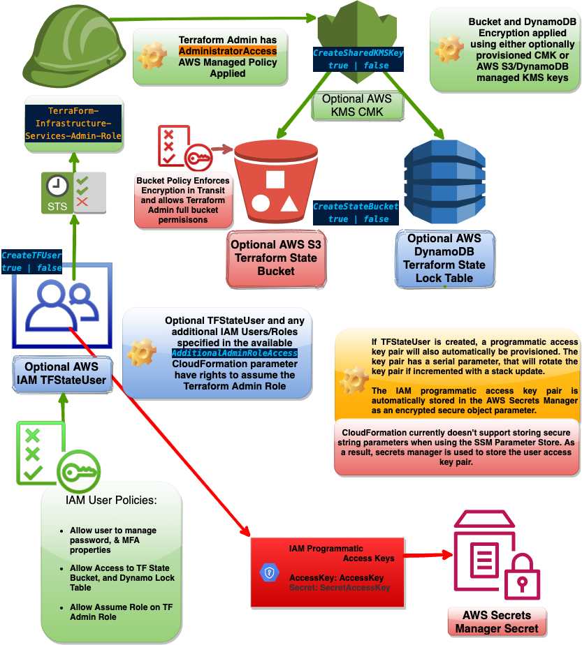
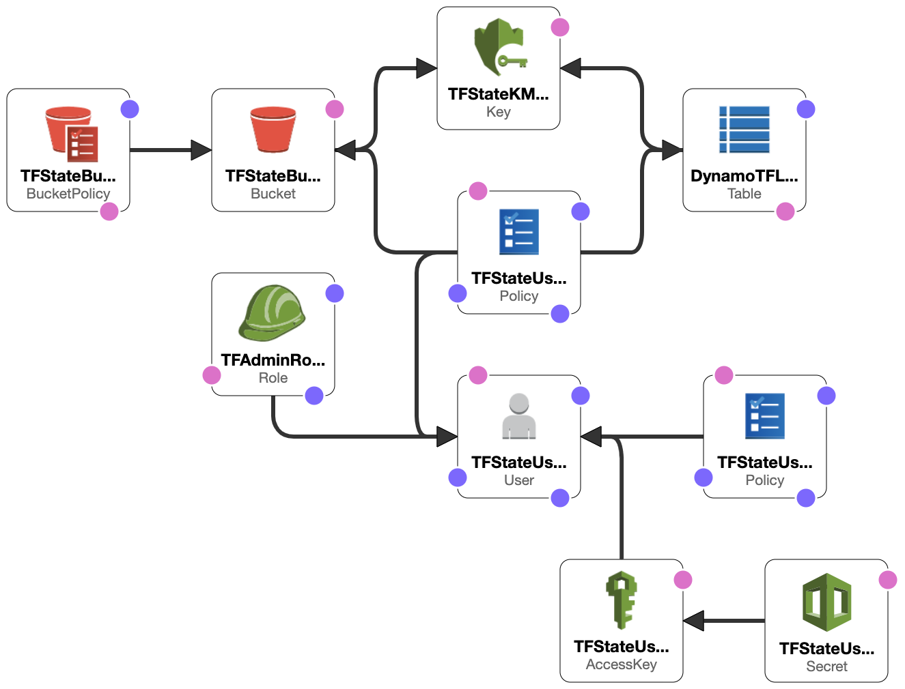
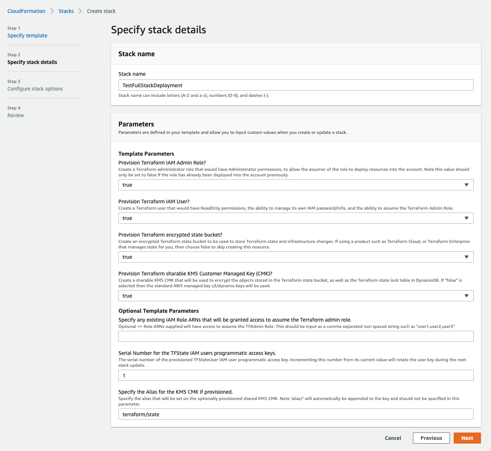
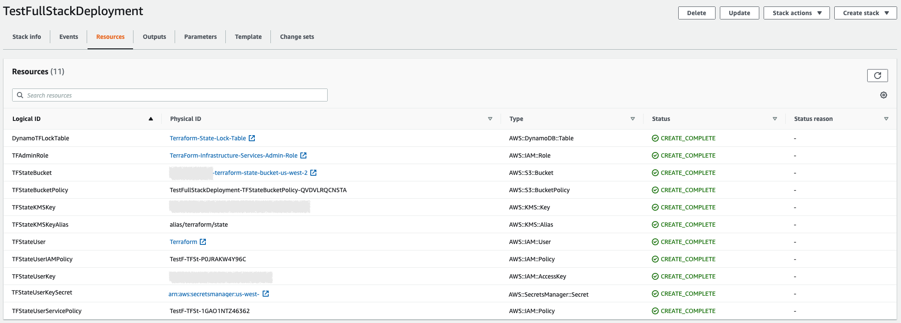
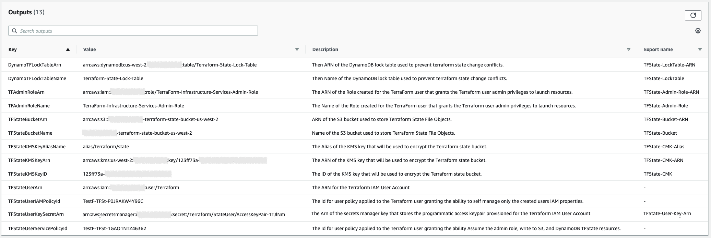
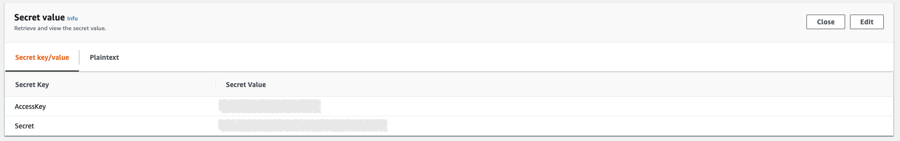

#  CloudFormation Terraform State Infra Template  

<br><br>

## Description

This CloudFormation template was created in order to provide a repeatable quick and effective way to instantiate the base infrastructure that would be needed in order to use Terraform within the environment. This template was designed as a dynamic template, meaning that the user launching the template will have the ability to choose which components will be deployed to the environment. The list of available options can be found in subsequent sections of this document.

<br><br>

__Full option deployment diagram:__

<br>



<br><br><br>

__Full option deployment CloudFormation designer diagram:__

<br>



<br><br>

## Pre-Requisite Templates

-----

The Following Templates are Pre-Requisite Templates that are required for this template to run as they will include previously provisioned resource exports that will be consumed by this template.  

<br>

| TemplateName:  | Required Export Name  | Required Exported Resources  |
|----------------|-----------------------|------------------------------|
| None           | N/A                   | N/A                          |  

<br><br>

## Parameters

The template takes the following parameters available at launch:  

<br>

### [CreateTFAdminRole](CreateTFAdminRole)

This parameter will specify if the template should create the Terraform State Admin Role. The parameter defaults to a value of `true`, and should only be set to `false` in the event the role already exists within the account. If this value is set to false and the role has not been previously provisioned within the account, then the template will fail to create the required infrastructure. This flag was included so that in the event that the Terraform State Infrastructure resources are desired in multiple regions, then the same base IAM role can be used, making it easier to control access to resources across regions.

* Expects [String](String) `true` or `false` value
* If `true` is selected, the __TerraForm-Infrastructure-Services-Admin-Role__ IAM role will be provisioned in the account.
* If `false` is selected, then the template will assume that the role has previously been created and will manually construct the role ARN where needed instead of trying to directly reference the resource within the template.

<br>

> The default value of this paramenter is set to `true`

__NOTE: To provide assume role access to other IAM users or roles, see the AdditionalAdminRoleAccess parameter below!__

<br>

### [CreateTFUser](CreateTFUser)

This parameter will specify if a Terraform IAM user will be provisioned within the account. 

If the user is provisioned, then an IAM programmatic Access Key, and Secret will also be automatically provisioned, and stored in AWS Secrets manager as an encrypted secure string. There has also been a __TFUserKeySerial__ parameter that will allow the provisioned key to be rotated via a stack update. Additional details can be found below in that parameters documentation.

Additionally 2 IAM policies will be automatically created. The first one will give the user the ability to control their own password (if console access is configured, which it is not by this template), the ability to manage it's own MFA devices, and the ability to perform an assume role on the Terraform State Admin Role also created by this template. The second policy will grant the user the rights required to write to the State Bucket and Dynamo Lock Tables if those resources are selected as well for provisioning.

* Expects [String](String) `true` or `false` value
* If `true` is selected, the __Terraform__ IAM user will be provisioned in the account, along with an access key pair stored in AWS secrets manager, and IAM policies granting the role access to assume the Terraform Admin Role, as well as to write to the optionally provisioned state bucket and dynamo lock table.
* If `false` is selected, then the user will not be created. Additionally no secret, or IAM policies will be provisioned either.

<br>

> The default value of this paramenter is set to `true`

<br>

### [TFUserKeySerial](TFUserKeySerial)

This parameter controls the serial number or version of the provisioned programatic access keys that were provisioned with the `Terraform` IAM user. The default integer value of the serial is set to `1`. In the event that the programtic access keys need to be reprovisioned, then the serial simply needs to be incremented by one, during a CloudFormation stack update. Incrementing the serial will tell CloudFormation to delete the existing key pair, re-provision a new keypair, and store that new keypair into AWS Secrets Manager.

* Expects [Number](Number) value greater or equal to `1`

<br>

> The default value of this paramenter is set to `1`

<br>

### [AdditionalAdminRoleAccess](AdditionalAdminRoleAccess)

This parameter will allow additional IAM user or role ARNS to be supplied which will be added to the principal list in the provisioned Terraform State Admin Role. Each ARN supplied in the comma-separated list value will be added to the roles principal list, allowing each of the specified resources the ability to assume the role.

* Expects [CommaDelimitedList](CommaDelimitedList) value containing ARNs without spaces such as => _arn:aws:iam::123456789012:user/someuser,arn:aws:iam::123456789012:role/somerole_

<br>

> The default value of this paramenter is null

__NOTE: Groups can _NOT_ be used as principals to IAM roles.__

<br>

### [CreateStateBucket](CreateStateBucket)

This parameter will specify if the template will provision the S3 Terraform state bucket, cooresponding state bucket access policy granting the Terraform Admin Role, and optional Terraform IAM user read/write access, service access IAM policy applied to the Terraform IAM user granting read/write access to the DynamoDB lock table, and the actual Dynamo DB lock table resource.

* Expects [String](String) `true` or `false` value
* If `true` is selected, the S3 bucket, bucket policy, IAM Terraform User service policy, and DynamoDB lock table will all be provisioned in the account.
* If `false` is selected, then these resources will not be created.

<br>

> The default value of this paramenter is set to `true`

<br>

### [CreateSharedKMSKey](CreateSharedKMSKey)

This parameter will specify if the template will provision a shared KMS Customer Managed Key (CMK). KMS CMKs are managed by account admins, and allows very granular control over the key usage which is set using a KMS key policy. CMKs also are allowed to be configured and used accross accounts within the same region. The optional CMK if provisioned will be used to encrypt the optional S3 state bucket, DynamoDB lock table, and AWS Secrets Manager secret.

* Expects [String](String) `true` or `false` value
* If `true` is selected, a KMS CMK will be provisioned and used to encrypt the optionally provisioned S3 state bucket, DynamoDB lock table, and AWS Secrets Manager secret containing the IAM Terraform user programmatic access keys.
* If `true` is selected, KMS will use the AWS managed KMS service keys to encrypt the optionally provisioned S3 state bucket (`alias/aws/s3`), DynamoDB lock table (`alias/aws/dynamodb`), and AWS Secrets Manager secret (`alias/aws/secretsmanager`) containing the IAM Terraform user programmatic access keys. Each resource will be encrypted with that service's AWS managed key. Resources encrypted using AWS managed KMS keys can not be altered, can not have permissions or the key policy modified in any way, and can not be shared accross accounts.

<br>

> The default value of this paramenter is set to `true`

__NOTE: Neither AWS managed KMS keys nor CMKs can be shared or used accross regions. Each region must have its own unique key.__

<br>

### [SharedKMSKeyAlias](SharedKMSKeyAlias)

This parameter simply sets the optionally provisioned KMS CMK's alias value.

* Expects [String](String) value of key alias
* The keyword `alias` should not be included in the parameter as its automatically pre-pended to the alias (`alias/`__parameter/value__)

<br>

> The default value of this paramenter is set to `terraform/state`

<br><br>

## Resources

The template will create the following resources at launch:

<br>

### [TFAdminRole](TFAdminRole)

The Terraform State IAM Admin Role

<br>

```yaml
Statement:
  - Effect: Allow
    Principal:
      AWS: [
        ${TFStateUser},
        @each ARN specified in ${AdditionalAdminRoleAccess}
      ]
    Action:
      - sts:AssumeRole
```

<br>

### [TFStateKMSKey](TFStateKMSKey) (Optional)

If selected, a KMS Customer Managed Key (CMK) will be provisioned with the specified alias as well as the following key policy:

<br>

```yaml
KeyPolicy:
  Version: "2012-10-17"
  Id: !Sub "Terraform-State-CMK-Policy-${AWS::Region}"
  Statement:
    - Sid: TFStateKeyOwnerPolicy
      Effect: Allow
      Principal:
        AWS: "arn:aws:iam::123456789101:root"
      Action:
        - "kms:*"
      Resource: "*"
    - Sid: TFStateKeyAdminPolicy
      Effect: Allow
      Principal:
        AWS: "arn:aws:iam::123456789101:root"
      Action:
        - "kms:Create*"
        - "kms:Describe*"
        - "kms:Enable*"
        - "kms:List*"
        - "kms:Put*"
        - "kms:Update*"
        - "kms:Revoke*"
        - "kms:Disable*"
        - "kms:Get*"
        - "kms:Delete*"
        - "kms:ScheduleKeyDeletion"
        - "kms:CancelKeyDeletion"
      Resource: "*"
    - Sid: TFStateKeyUsagePolicy
      Effect: Allow
      Principal:
        AWS: "arn:aws:iam::123456789101:role/TerraForm-Infrastructure-Services-Admin-Role"
      Action:
        - "kms:Encrypt"
        - "kms:Decrypt"
        - "kms:ReEncrypt*"
        - "kms:GenerateDataKey*"
        - "kms:DescribeKey"
      Resource: "*"
```

<br>

### [TFStateBucket](TFStateBucket) (Optional)

If selected, an S3 state bucket will be provisioned. The bucket will be encrypted with either an optional CMK if selected and provisioned, or with the AWS Managed `alias/aws/s3` KMS key. The bucket will also have the following bucket policy automatically applied:

<br>

```yaml
  PolicyDocument:
    Version: "2012-10-17"
    Statement:
      - Sid: "DenyNonSecureTransport"
        Effect: Deny
        Principal:
          AWS: "*"
        Action:
          - "s3:*"
        Resource:
          - arn:aws:s3:::123456789101-terraform-state-bucket-us-east-1
          - arn:aws:s3:::123456789101-terraform-state-bucket-us-east-1/*
        Condition:
          Bool:
            aws:SecureTransport: false
      - Sid: "DenyIncorrectEncryptionHeader"
        Effect: Deny
        Principal:
          AWS: "*"
        Action: "s3:PutObject"
        Resource:
          - arn:aws:s3:::123456789101-terraform-state-bucket-us-east-1
          - arn:aws:s3:::123456789101-terraform-state-bucket-us-east-1/*
        Condition: {
          "ForAnyValue:StringNotEquals":
            {
              "s3:x-amz-server-side-encryption": [
                "aws:kms",
                "AES256"
              ]
            }
        }
      - Sid: DenyUnEncryptedObjectUploads
        Effect: Deny
        Principal:
          AWS: "*"
        Action: "s3:PutObject"
        Resource:
          - arn:aws:s3:::123456789101-terraform-state-bucket-us-east-1
          - arn:aws:s3:::123456789101-terraform-state-bucket-us-east-1/*
        Condition: {
          "Null": {
            "s3:x-amz-server-side-encryption": "true"
          }
        }
      - Sid: AllowTFAdminUsage
        Effect: Allow
        Principal:
          AWS: "arn:aws:iam::123456789101:role/TerraForm-Infrastructure-Services-Admin-Role"
        Action: "s3:*"
        Resource:
          - arn:aws:s3:::123456789101-terraform-state-bucket-us-east-1
          - arn:aws:s3:::123456789101-terraform-state-bucket-us-east-1/*
```

<br>

### [DynamoTFLockTable](DynamoTFLockTable) (Optional)

Controlled by the `CreateStateBucket` parameter, If selected, a DynamoDB state lock table will be provisioned. The table will be encrypted with either an optional CMK if selected and provisioned, or with the AWS Managed `alias/aws/dynamodb` KMS key. The table is used to ensure that states that are in the process of being modified, cannot be modified simultaneously from another user, which could cause state file corruption.

<br>

### [TFStateUser](TFStateUser) (Optional)

If selected, a Terraform IAM user will be provisioned. The user will have 1/2 policies applied that will grant the user the ability to manage IAM user password and MFA device settings for the users account, allow the assumption of the Terraform Admin Role provisioned above, and finally if the Terraform state bucket and dynamodb lock tables where selected and provisioned, then a second policy granting permissions to those resources will also be appended to the users inline policy.

In addition to the user account and permissions, the user will also automatically have a programmatic access key pair provisioned and stored in AWS Secrets manager that will be encrypted using either the optional CMK if provisioned or the AWS Managed `alias/aws/secretsmanager` KMS key.

<br>

__NOTE: The user will also have the ReadOnly AWS Managed Policy applied.__

<br>

*IAM user management policy*

```yaml
PolicyDocument:
  Version: "2012-10-17"
  Statement:
    - Sid: AllowGetIAMSelfDetails
      Effect: Allow
      Action:
        - iam:GetAccountPasswordPolicy
        - iam:ListVirtualMFADevices
      Resource: "*"
    - Sid: AllowManageIAMSelfPassword
      Effect: Allow
      Action:
        - iam:GetUser
        - iam:ChangePassword
      Resource: "arn:aws:iam::123456789101:user/${aws:username}"
    - Sid: AllowManageIAMSelfMFADevice
      Effect: Allow
      Action:
        - iam:CreateVirtualMFADevice
        - iam:DeleteVirtualMFADevice
      Resource: "arn:aws:iam::123456789101:user/${aws:username}"
    - Sid: AllowManageIAMSelfMFA
      Effect: Allow
      Action:
        - iam:DeactivateMFADevice
        - iam:EnableMFADevice
        - iam:GetUser
        - iam:ListMFADevices
        - iam:ResyncMFADevice
      Resource: "arn:aws:iam::123456789101:user/${aws:username}"
    - Sid: AssumeTFAdminRole
      Effect: Allow
      Action:
        - sts:AssumeRole
      Resource:
        # Manually construct the Role ARN, to remove a circular dependency condition
        - "arn:aws:iam::123456789101:role/TerraForm-Infrastructure-Services-Admin-Role"
```

<br><br>

*IAM User Service Policy (Only if `CreateStateBucket` set `true`)*

```yaml
PolicyDocument:
  Version: "2012-10-17"
  Statement:
    - Sid: S3TFStateAccessPolicy
      Effect: Allow
      Action:
        - s3:PutObject
        - s3:GetObject
        - s3:ListBucket
      Resource:
        - arn:aws:s3:::123456789101-terraform-state-bucket-us-east-1
        - arn:aws:s3:::123456789101-terraform-state-bucket-us-east-1/*
    - Sid: DynamoDBTFStateLockTablePolicy
      Effect: Allow
      Action:
        - dynamodb:GetItem
        - dynamodb:PutItem
        - dynamodb:DeleteItem
      Resource:
        - arn:aws:dynamodb:us-east-2:123456789012:table/Terraform-State-Lock-Table
        - arn:aws:dynamodb:us-east-2:123456789012:table/Terraform-State-Lock-Table/index/*
    - Sid: AssumeTFAdminRole
    Effect: Allow
    Action:
        - sts:AssumeRole
    Resource:
        # Manually construct the Role ARN, to remove a circular dependency condition
        - "arn:aws:iam::123456789101:role/TerraForm-Infrastructure-Services-Admin-Role"
```

<br>

### [TFStateUserKey](TFStateUserKey) (Optional)

Programmatic Access Keys that are automatically provisioned for the terrafor user if selected for provisioning during launch.

<br>

### [TFStateUserKeySecret](TFStaTFStateUserKeySecretteUserKey) (Optional)

AWS Secrets Manager secret containing the programmatic access key optionally provisioned if the terraform user was selected for provisioning.

<br>

## Outputs and Exports

The following Outputs will be created:

<br>

| Logical ID:                      | Value:                                              | Export Key:                |
|--------------------------------- |---------------------------------------------------- |--------------------------- |
| TFStateKMSKeyID                  | CMK ID                                              | TFState-CMK                |
| TFStateKMSKeyArn                 | CMK ARN                                             | TFState-CMK-ARN            |
| TFStateKMSKeyAliasName           | CMK Alias                                           | TFState-CMK-Alias          |
| TFStateBucketName                | S3 State Bucket Name                                | TFState-Bucket             |
| TFStateBucketArn                 | S3 State Bucket ARN                                 | TFState-Bucket-ARN         |
| DynamoTFLockTableName            | DynamoDB Table Name                                 | TFState-LockTable          |
| DynamoTFLockTableArn             | DynamoDB Table ARN                                  | TFState-LockTable-ARN      |
| TFStateUserArn                   | Terraform IAM User ARN                              | TFState-User-Arn           |
| TFStateUserKeySecretArn          | Terraform User Access Keypair SecretsMgr ARN        | TFState-CMK-ARN            |
| TFStateUserIAMPolicyId           | Terraform IAM User IAM Policy Name                  | No Export                  |
| TFStateUserServicePolicyId       | Terraform IAM User Service Policy Name              | No Export                  |
| TFAdminRoleName                  | Terraform Admin Role Name                           | TFState-Admin-Role         |
| TFAdminRoleArn                   | Terraform Admin Role ARN                            | TFState-Admin-Role-ARN     |

<br>

## Example Launch

Screenshots section to show examples of a CloudFormation Template launch through the AWS CloudFormation Console:

<br>

### CFN Parameters



<br>

### CFN Deployed Resources



<br>

### CFN Outputs



<br>

### Secrets Manager



<br>
